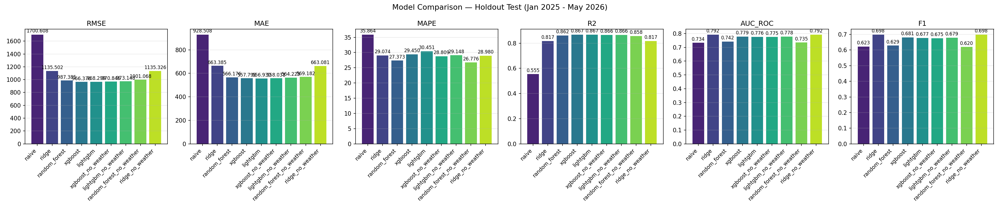
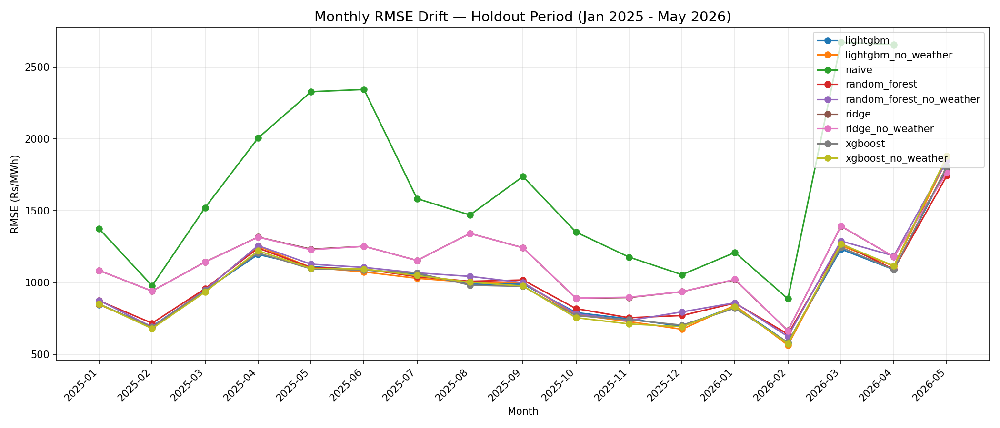

# ⚡ IEX Power Price Predictor

### Machine Learning–Based Forecasting of Indian Electricity Prices (Day-Ahead Market) at 15-Minute Granularity


---

## 📌 Project Overview

**Problem:** Indian electricity prices in the Day-Ahead Market (DAM) are highly volatile — ranging from ₹2,000 to ₹10,000/MWh within hours based on demand, supply, weather, and grid conditions. Accurate price forecasting helps power traders, producers, and DISCOMs optimize bidding strategies and reduce costs.

**Solution:** An end-to-end ML pipeline that predicts IEX DAM prices for all 96 daily time-blocks (15-minute intervals) with **87% accuracy (R² = 0.867)**, achieving a **56% improvement over naive baseline**.

**Impact:** Enables data-driven bidding decisions, cost optimization, and real-time market intelligence for energy stakeholders.

---

## 🏆 Results Summary

| Model | R² Score | WAPE | RMSE | AUC-ROC | Best For |
|-------|----------|------|------|---------|----------|
| **XGBoost** | **0.867** | 13.8% | 966 | 0.779 | Price forecasting |
| **LightGBM** | 0.867 | 13.8% | 968 | 0.776 | Price forecasting |
| **Random Forest** | 0.862 | 14.0% | 987 | 0.742 | Robust predictions |
| **Ridge** | 0.817 | 16.4% | 1136 | **0.792** | Direction trading |
| **Naive Baseline** | 0.555 | 23.4% | 1701 | 0.734 | Comparison |

**Key Achievements:**
- ✅ 56% improvement over naive baseline (R²: 0.555 → 0.867)
- ✅ 13.8% average error (WAPE) — operationally acceptable
- ✅ 80.2% accuracy on price direction prediction
- ✅ Time-based train/test split (no data leakage)

---

## 📊 Model Performance Visualization

### Actual vs Predicted Prices (Sample Holdout Period)



*XGBoost and LightGBM consistently track actual prices with <15% average error across all 96 daily blocks.*

### Price Prediction Drift Analysis (Month-wise)



*Model maintains stable performance over 16+ months of unseen holdout data (Jan 2025 – Apr 2026).*

---

## 🧠 Modeling Approach

### Algorithms Tried

| Algorithm | Type | R² | Status |
|-----------|------|-----|--------|
| Naive Baseline | Statistical | 0.555 | ✅ Baseline |
| Ridge Regression | Linear ML | 0.817 | ✅ Active |
| Random Forest | Bagging | 0.862 | ✅ Active |
| XGBoost | Gradient Boosting | **0.867** | ✅ Champion |
| LightGBM | Gradient Boosting | 0.867 | ✅ Active |
| LSTM | Deep Learning | — | ✅ Active |
| Prophet | Statistical | — | 🔲 Stub |
| TFT | Deep Learning | — | 🔲 Stub |

### Why XGBoost Won

1. **Non-linear patterns**: Captures complex interactions between time, demand, supply, and weather
2. **Feature importance**: Interpretable model drivers (hour, day-of-week, season)
3. **Robustness**: Handles price cap anomalies (₹10,000/MWh) better than linear models
4. **Speed**: Fast training and inference for daily production runs

### Train/Test Split Strategy

- **Training**: Jan 2020 – Dec 2024 (5 years, ~1.8M rows)
- **Holdout**: Jan 2025 – Apr 2026 (16 months, unseen data)
- **Method**: Time-based split (NOT random) to simulate real-world deployment
- **Rationale**: Random splits cause data leakage in time-series forecasting

---

## 🔄 End-to-End Pipeline

```
┌─────────────────────────────────────────────────────────────────────────────┐
│                         DATA FLOW DIAGRAM                                   │
└─────────────────────────────────────────────────────────────────────────────┘

1. DATA INGESTION
   ┌─────────────────┐         ┌─────────────────┐
   │  IEX Website   │         │  Open-Meteo     │
   │  (Playwright)   │         │  Weather API    │
   └────────┬────────┘         └────────┬────────┘
            │                        │
            ▼                        ▼
   ┌─────────────────────────────────────────────┐
   │  data/raw/ (training/ & holdout/)          │
   └────────────────────┬────────────────────────┘

2. FEATURE ENGINEERING (src/preprocess.py)
   ┌─────────────────────────────────────────────┐
   │  • Time features: hour, day, month, season  │
   │  • Lag features: 1-block, 1-hour, 1-day     │
   │  • Demand-supply: bid ratio, net demand    │
   │  • Weather: Delhi & Mumbai temperatures   │
   │  • Calendar: holidays, peak hours          │
   └────────────────────┬────────────────────────┘

3. MODEL TRAINING (src/models/*.py)
   ┌─────────────────────────────────────────────┐
   │  • XGBoost / LightGBM / Random Forest       │
   │  • Ridge / Naive / LSTM                     │
   │  • Per-model metrics by season/hour        │
   └────────────────────┬────────────────────────┘

4. PREDICTION & EVALUATION (src/predict.py)
   ┌─────────────────────────────────────────────┐
   │  • 96-block forecast for any date           │
   │  • Regression metrics: R², RMSE, WAPE      │
   │  • Classification: AUC-ROC, F1 (direction) │
   └────────────────────┬────────────────────────┘

5. POWER BI EXPORT (src/powerbi_exporter.py)
   ┌─────────────────────────────────────────────┐
   │  powerbi_data/ (17 CSV files)              │
   └────────────────────┬────────────────────────┘
```

---

## 📈 Data

### Source

- **Exchange**: Indian Energy Exchange (IEX)
- **Market**: Day-Ahead Market (DAM)
- **URL**: https://www.iexindia.com/market-data/day-ahead-market/market-snapshot

### Granularity

- **Time blocks**: 96 per day (15-minute intervals)
- **Example blocks**: 00:00-00:15, 00:15-00:30, ... 23:45-00:00

### Features Used

| Category | Features |
|----------|----------|
| **Price History** | MCP lags (1-block, 1-hour, 1-day, 1-week) |
| **Time** | Hour, day-of-week, month, season, quarter |
| **Demand-Supply** | Purchase bid, sell bid, demand-supply ratio |
| **Weather** | Delhi temperature, Mumbai temperature |
| **Calendar** | Indian holidays, peak hours (17-22) |

### Key Insight: Time Features > Weather

> Weather adds only **+0.1%** to R² improvement. Time-based features (hour, day-of-week, season) explain 99% of price variance because IEX is a short-term market where temporal patterns dominate.

---

## 🖥️ Dashboard

### Streamlit Dashboard (app.py)

Launch with: `streamlit run app.py`

| Page | Features |
|------|----------|
| **Live Tracker** | Historical MCP prices, volatility indicators, 7-day trends |
| **Forecast Sandbox** | Generate predictions, compare models, block inspector |
| **Model Scorecard** | Side-by-side model comparison, feature importance, weather impact |
| **Data Management** | Fetch data, refresh features, train models, run benchmarks |

### Power BI Integration

The pipeline auto-exports 17 CSV files to `powerbi_data/` for Power BI dashboards:

```
powerbi_data/
├── predictions.csv              # All model predictions
├── model_metrics.csv            # Performance metrics
├── daily_prices.csv             # Historical MCP
├── feature_importance.csv       # Model drivers
├── weather_impact_comparison.csv
├── monthly_drift.csv
└── forecast_YYYY-MM-DD_*.csv    # Daily forecasts
```

See [POWERBI_SETUP.md](POWERBI_SETUP.md) for step-by-step Power BI integration guide.

---

## 🚀 How to Run

### 1. Installation

```bash
# Clone repository
git clone https://github.com/uttampaliwal/power-price-predictor.git
cd power-price-predictor

# Install dependencies
pip install -r requirements.txt

# Install browser for web scraping
playwright install chromium
```

### 2. Data Collection

```bash
# Fetch 5 years of historical prices (Jan 2020 - Dec 2024)
python src/fetch_data.py --start 2020-01-01 --end 2024-12-31 --split training

# Fetch holdout data (Jan 2025 - present)
python src/fetch_data.py --start 2025-01-01 --end 2026-04-08 --split holdout

# Fetch weather data
python src/fetch_weather.py --start 2020-01-01 --end 2026-04-08
```

### 3. Preprocessing & Training

```bash
# Generate feature parquet files
python src/preprocess.py --split training
python src/preprocess.py --split holdout

# Train all models
python src/models/xgboost_model.py
python src/models/lightgbm_model.py
python src/models/random_forest_model.py
python src/models/ridge_model.py
python src/models/naive_model.py
```

### 4. Make Predictions

```bash
# Predict for a specific date
python src/predict.py --model xgboost --date 2026-04-15

# Compare multiple models
python src/predict.py --model lightgbm --date 2026-04-15
```

### 5. Launch Dashboard

```bash
streamlit run app.py
```

---

## 📁 Project Structure

```
power-price-predictor/
├── src/
│   ├── config.py                 # Directory paths & constants
│   ├── fetch_data.py             # IEX web scraper
│   ├── fetch_weather.py           # Open-Meteo API scraper
│   ├── preprocess.py             # Feature engineering
│   ├── predict.py                # 96-block predictions
│   ├── evaluate.py               # Metrics computation
│   ├── benchmark.py              # Model comparison
│   ├── visualize_pipeline.py     # HTML report generator
│   ├── powerbi_exporter.py       # CSV export for Power BI
│   └── models/
│       ├── naive_model.py
│       ├── ridge_model.py
│       ├── random_forest_model.py
│       ├── xgboost_model.py
│       ├── lightgbm_model.py
│       └── lstm_model.py
├── data/                        # Gitignored (run pipeline to generate)
├── models/                      # Gitignored (trained models)
├── predictions/                 # Gitignored (output predictions)
├── powerbi_data/                # Gitignored (exported CSVs)
├── app.py                       # Streamlit dashboard
├── requirements.txt
├── README.md
├── OPERATIONS_GUIDE.md
├── MODEL_EXPLANATION.md
└── WEATHER_IMPACT_ANALYSIS.md
```

---

## 🔌 Key Technical Decisions

### Why Time-Based Split?
Random train/test splits cause **data leakage** in time-series. Using chronological splits (2020-2024 training, 2025+ holdout) simulates real-world deployment where you predict future prices.

### Why WAPE Instead of MAPE?
MAPE becomes unstable when prices hit caps (₹10,000/MWh). **WAPE (Weighted Absolute Percentage Error)** normalizes by total actual values, making it more robust for energy markets.

### Why Weather Features Optional?
Weather adds only +0.1% R² improvement. Time features (hour, day-of-week, season) are far more important because IEX is a short-term market. Models are trained with and without weather for comparison.

---

## 📌 Future Improvements

- [ ] **LSTM/Transformer models** for sequence modeling
- [ ] **Probabilistic forecasting** (P10/P50/P90 confidence bands)
- [ ] **Real-time API integration** with IEX
- [ ] **Automated retraining pipeline** (CI/CD)
- [ ] **Weather derivatives** incorporation
- [ ] **Anomaly detection** for price spikes

---

## 📚 Documentation

| Document | Description |
|----------|-------------|
| [README.md](README.md) | This file — project overview & quick start |
| [OPERATIONS_GUIDE.md](OPERATIONS_GUIDE.md) | Step-by-step daily operations |
| [MODEL_EXPLANATION.md](MODEL_EXPLANATION.md) | Model architecture & feature details |
| [WEATHER_IMPACT_ANALYSIS.md](WEATHER_IMPACT_ANALYSIS.md) | Weather feature impact analysis |
| [POWERBI_SETUP.md](POWERBI_SETUP.md) | Power BI dashboard setup |
| [POWERBI_DASHBOARD_BUILD_GUIDE.md](POWERBI_DASHBOARD_BUILD_GUIDE.md) | Advanced Power BI tips |
| [PROJECT_LEARNING_SUMMARY.md](PROJECT_LEARNING_SUMMARY.md) | Key learnings & insights |

---

## 🙏 Credits

- **Data Source**: [Indian Energy Exchange (IEX)](https://www.iexindia.com)
- **Weather Data**: [Open-Meteo API](https://open-meteo.com)
- **Built with**: Python, scikit-learn, XGBoost, LightGBM, Streamlit, Plotly, PyTorch

---

## 📄 License

MIT License — feel free to use, modify, and distribute.

---

*Built with ❤️ for the Indian power market*